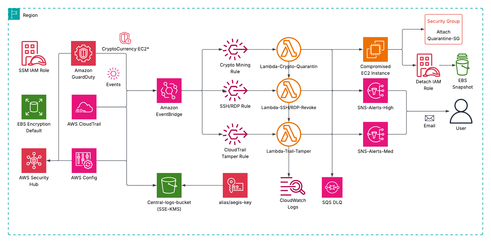

# Aegis — AWS Security Baseline & Auto-Remediation

<p align="center">
  
</p>
<p align="center">
  
  
  
  
  
  
  
</p>

# Overview 
An AWS security foundation with compliance (**AWS Config**), centralized logging (**CloudTrail, S3**), security detection (**AWS GuardDuty**), real-time auto-remediation (**EventBridge + Lambda + SNS**) and centralized monitoring (**AWS Security Hub**).

This project is designed to deploy your AWS cloud account as a central security operations platform with foundational security spine baked in, all using **Terraform (IaC)**. I named it after **Aegis**, mythical shield device used by **Athena** and **Zeus**, fitting for a security project. The spine enforces baseline controls (**AWS Config**) for compliance, **S3** for central logs, one **KMS** key for encryptions (cheaper, faster, easy to rotate), and three **Lambda** remediations that utilizes modern architecture with **CloudTrail, EventBridge, Lambda** and **SNS** for real time detection, remediation, and alerts. It solves security concerns such as open ports, log tampering, and malicious activity (**GuardDuty** CryptoCurrency/Bitcoin mining findings). 

Because security is job zero, I wanted to implement what I have learned from my **AWS Certified Security Specialty** certification. Something that proves (secure-by-default),  operations maturity, and results. From here, it bridges both my love for Cloud Computing and Cybersecurity. A runbook is also integrated aligning with the **NIST CSF 2.0**, something I learned in my **Google Cybersecurity Course** from **Coursera**.

# Capabilities / Features
- **Terraform modules**: Root module + 15 submodules 
- **Hardened access:** Custom IAM role for SSM with IAM profile for EC2, lambda execution roles, and config role.  Sometimes `AWSServiceRoleForConfig` doesn't exist so the Terraform code fails, created custom config role for ease of use. Note that `AWSServiceRoleForConfig` is generally recommended for Config but for this project I made it optional for a one click `terraform apply` command. It uses AWS's managed service role policy. 
- **Centralized logging:** One S3 central logging bucket (BPA on, versioning, SSE-KMS).
- **KMS encryption:** Single KMS key to keep costs/simple and easier to rotate.
- **Lambda real-time response:** 
  - CloudTrail tamper auto-remediation (StopLogging/DeleteTrail/UpdateTrail/PutEventSelectors).
  - SSH/RDP world-open guard for Security Groups (Port 22 & 3389) works for IPv4 and IPv6.
  - GuardDuty CryptoCurrency (Bitcoin mining) findings (e.g. CryptoCurrency:EC2/BitcoinTool.B*). 
- **Alerts:** Encrypted SNS topics (HIGH / MED) with clear emails.
- **SQS DLQ**: Added for Lambda failures, failed events can be investigated (still updating).
- **SecurityHub**: Enabled for centralized monitoring, two foundational standards and an additional resource tagging standard, and two product subscriptions (GuardDuty & Inspector). I have not added AWS Macie for cost efficient and since there's no PII/SPII being handled here for this project. Enable Macie when handling sensitive info.
  - **CIS AWS Foundations Benchmark v1.4.0**
  - **AWS  Foundational Security Best Practices v1.0.0**
  - **AWS Resource Tagging Standard v1.0.0**
- **Compliance (AWS Config):** Curated AWS managed rules for a baseline. Config Auto-remediation with SSM documents is not yet included but its part of the future plans. 

## Table of Contents 
- [Terraform Modules](#terraform-modules)
- [AWS Config Rules](#aws-config-rules)
- [Prerequisites](#prerequisites)
- [Implementation Details](#implementation-details)
- [Validation & Testing](/docs/testing.md)
- [Runbook](/RUNBOOK.md)
- [Troubleshooting](#troubleshooting)
- [Costs & Environments](#costs--environments)
- [Limitations & Enhancements](#limitations--future-enhancements)

## Terraform modules

| Module         | Purpose                                               |
|----------------|-------------------------------------------------------|
| `s3/` | Reuseable S3 bucket for central logging (SSE-KMS + BPA) |
| `cloudtrail/`      | Multi-Region CloudTrail with KMS encryption & log validation |
| `config/`          | AWS Config rules baseline & recorder               |
| `cloudwatch_logs/`          | Central logs for Lambda automations              |
| `cloudwatch_dashboard/`          | Central dashboard for lambda automations            |
| `ebs/`             | Enforces default EBS encryption at account level   |
| `eventbridge/`     | Event rules for Lambda automation            |
| `guardduty/`       | GuardDuty detector for continuous threat detection |
| `kms/`             | Central KMS CMK + alias for log/service encryption |
| `lambda/`          | Remediation Lambdas for security automation |
| `security_hub/`    | Security Hub enablement + CIS + Resource & AFSBP standards    |
| `sg/`              | Quarantine Security Group for crypto mining              |
| `sns/`             | Encrypted SNS topics (HIGH / MED alerts)           |
| `sqs/`             | SQS dead letter queue for failed Lambda events                       |
| `iam_role/`             | IAM role for SSM access        |


## AWS Config Rules

| Rule Name                               | Description                                         | Remediation / Notes                  |
|-----------------------------------------|-----------------------------------------------------|--------------------------------------|
| `EC2_EBS_ENCRYPTION_BY_DEFAULT`         | Ensures EBS volumes are encrypted by default.       | Alert-only                                 |
| `EC2_IMDSV2_CHECK`                      | Requires EC2 instances to use IMDSv2.              | Alert-only                                  |
| `RESTRICTED_COMMON_PORTS`               | Checks that common ports aren’t open to the world. | Alert-only   |
| `RESTRICTED_SSH`                        | Prevents SSH access from 0.0.0.0/0.                | Auto-remediation (Lambda isolation)   |
| `S3_BUCKET_LEVEL_PUBLIC_ACCESS_PROHIBITED` | Blocks public S3 bucket access.                   | Alert-only                          |
| `CLOUD_TRAIL_ENABLED`                   | Ensures CloudTrail is enabled multi-region.        | Auto-remediation (Lambda remediation)            |
| `IAM_USER_MFA_ENABLED`                  | Requires MFA for IAM users.                        | Alert-only                            |

# Prerequisites
- **Terraform**: [Install](https://developer.hashicorp.com/terraform/install)
- **Install/Update AWS CLI v2**: --> [Tutorial here](https://docs.aws.amazon.com/cli/latest/userguide/getting-started-install.html)
- **Quick setup (`aws configure`)**: --> [Tutorial here](https://docs.aws.amazon.com/cli/latest/userguide/getting-started-quickstart.html)
- You'll need your own tfvars with proper variable inputs. ***I have excluded mine for best practice. Never commit tfvars to version control.*** Create a dev.tfvars or prod.tfvars under /envs/dev or /envs/prod. In this example, I have used dev.tfvars. 
- A sample tfvars.example file is included to help you structure your variable inputs. Make sure to name it either **dev.tfvars** or **prod.tfvars** --> [Sample here](examples/dev.tfvars.example)
- If you have any issues, see the [Troubleshooting](#troubleshooting) section below. 

# Implementation Details
```bash
# Open your CLI terminal (Linux, Windows Powershell, etc.)
# To start, clone the repo then follow the steps under.

git clone https://github.com/z31nnx/aegis-aws-security.git

# Configure your AWS profile // Provide Access Key ID, Secret Access Key, and default region
aws configure

# Change to an environment folder
cd ./aegis-aws-security/terraform/envs/dev

# Initialize
terraform init

# Plan & apply with your tfvars
terraform plan  -var-file="dev.tfvars"
terraform apply -var-file="dev.tfvars"

# When you want to nuke/destroy everything:
terraform destroy -var-file="dev.tfvars"
```

# Validation & Testing
For the full step-by-step testing guide with screenshots, see [docs/testing.md](./docs/testing.md)

| Scenario | How to simulate (safe) | Expected outcome |
|---|---|---|
| CloudTrail tamper | Delete/Stop/Update via AWS Console | Lambda re-enables/re-creates trail, goes back to baseline; HIGH SNS alert; DLQ on failure |
| SSH open to world | Create SG with `0.0.0.0/0` on port 22 | Lambda removes ingress / quarantines SG; MED SNS alert |
| RDP open to world | Create SG with `0.0.0.0/0` on port 3389 | Same as above |
| Crypto mining findings | Go on GuardDuty console and **Generate sample findings** | Lambda fires on GuardDuty CryptoCurrency events via EventBridge service; HIGH SNS alert |

## Runbook
- See [RUNBOOK.md](./RUNBOOK.md) for details on how to handle events. 

## Troubleshooting
- **Terraform apply**: If you can't `terraform apply -var-file="dev.tfvars"`, have your AWS credentials and access/secret keys configured using your preferred CLI. Then rerun `terraform init` inside **./aegis-aws-security/terraform/envs/dev** folder.
- **SNS/Email Alerts**: Check if the two subscriptions are confirmed, sometimes it's buried under junk in your email. For GuardDuty findings, wait 2-5 mins. 
- **Lambda keeps failing -> DLQ**: Adjust the timeout length if needed especially for CryptoCurrency lambda remediation. Inspect SQS DLQ message for failed automations.
- **Config errors**: Ensure the custom Config role exists; rerun `terraform apply`.
- **Security Hub not enabled**: If for some reason its off,  just enable via console (this is normal, the standards and product subscriptions are still applied). Otherwise config must be enabled in order for Security Hub to work.
- **Terraform destroy**: Ensure no instances are using the quarantine SG, else the destroy command fails. 

## Limitations & Future Enhancements
- Currently only single-account setup.
- Custom VPC but currently there are no workloads being deployed.
- SCP for CloudTrail (AWS Organization required).
- Add more remediation Lambdas (S3 public access detection, compromised IAM key, etc.).
- Config automation via SSM documents. 

## Costs & Environments
- **Small prod account**: Typically not much, just tens of USD/month for CloudTrail, Config evals, GuardDuty, and S3 logs. Depends on event/log volumes. 
- Please I highly recommend reviewing [AWS Pricing Calculator](https://calculator.aws/#/) for your use case. 

## License
This project is licensed under the MIT License, see the [LICENSE](./LICENSE) file for details.
