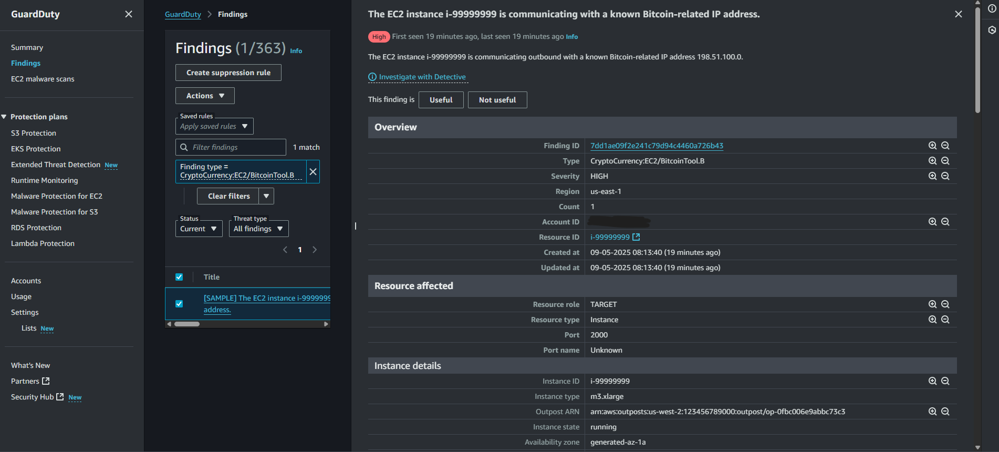
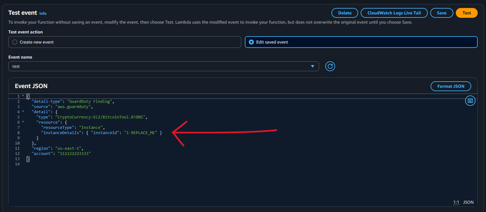
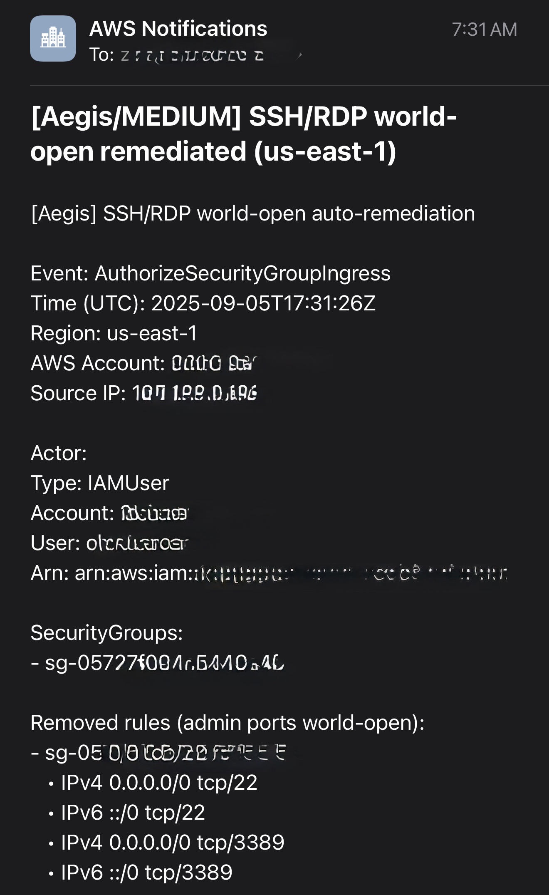

# Aegis Testing Guide
This guide demonstrate how to test and validate each automated remediation with safe tests in the AWS console. Each scenario includes the steps, thought process, results, and screenshots. Ensure you have everything ready before going forward with this. See [Prerequisites](/README.md#prerequisites) for more details. 

# Contents: 
- [CloudTrail Tamper](/docs/testing.md#1-cloudtrail-tamper)
- [SSH/RDP World-Open Security Groups](/docs/testing.md#2-sshrdp-world-open-security-groups)
- [GuardDuty Crypto Mining Findings](/docs/testing.md#3-guardduty-crypto-mining-findings)
- [Manual EC2 Crypto Mining Isolation Test](/docs/testing.md#4-manual-ec2-crypto-mining-isolation-test)
- [AWS Config Dashboard](/docs/testing.md#5-aws-config-dashboard)
- [Email Examples](/docs/testing.md#6-email-dump-screenshots)

# Notes
- SNS emails sometimes go to spam/junk folder. Confirm subscription first.
- Destroy test SGs/instances after validating.
- Destroy any remaining EBS snapshots. 

## 1. CloudTrail Tamper

- **Objective:** Prove that if CloudTrail is stopped, deleted, or modified, our Lambda automation restores it.
- **Steps to simulate the tamper:**
1. Go to the AWS Console, head towards CloudTrail and click on Aegis trail. You should see "Stop Logging" as shown below.

2. Click it, wait a few seconds and then refresh the page.

3. If it's **successful**, Logging  should be back on.

4. Check your email, an alert should have notified you. Click here to see what it would look like -> [email.](./screenshots/email_ct.png) 

## 2. SSH/RDP World-Open Security Groups

- **Objective:** Deletes exposed ports 22 or 3389 open to 0.0.0.0/0 (IPv4) and ::/0 (IPv6).
- **Steps below to simulate exposure:**
1. Go to EC2 console, click Security groups on the left section. 
2. Create or edit a SG. For this demo, I will create a SG with 4 inbound rules (`TCP 22 and TCP 3389`), source `0.0.0.0/0` (IPv4) and `::/0` (IPv6).

3. Save changes. It should look like this below. 

4. Lambda should fire within seconds, refresh page and your inbound rules should be gone. Note that this remediation does not delete the entire Security Group. When the SG is critical, this could be bad so this remediation ensures only exposed SSH/RDP will be remediated. 

5. Additional tags would be created to ensure evidence of what happened.

6. SNS alert email would be generated with key important details of the remediation. [Email detail.](./screenshots/email_ssh.png)

## 3. GuardDuty Crypto Mining Findings 

1. Head to GuardDuty console.
2. Click on Settings and generate sample findings. 

3. The findings are generated quickly but the event takes about 2-5 mins (near-realtime) so your lambda should fire and an SNS email alert should be sent to you [Email detail.](./screenshots/email_crypto.png) 

## 4. Manual EC2 Crypto Mining Isolation Test
1. Additionally, if you'd like to run a proper EC2 isolation test then follow the steps below. 
2. Create an EC2 instance, name it what you want. Create a SG for it then attach an IAM role that is provisioned from our Terraform code (SSH isn't needed). When the instance is fully running, copy the instance ID.

3. Head to Lambda console, click on testing. Paste the provided JSON format code under testing. The code will be here -> [crypto_test.json](/examples/crypto_test.json), adjust the code as needed. Add your instance ID on the `"i-REPLACE_ME"` area.

4. Click test. Head back to your EC2 instance, if done correctly you should see your instance in the "stopping" state. IAM role should be detached, quarantine Security Group should be attached, new Tags would be created and a Snapshot would take in place.

## 5. AWS Config Dashboard
1. Go to the Config console, on the left column select rules (IMDSv2, MFA enabled, etc).
2. You should see under "Detective compliance" with a `Compliant/Noncompliant`
3. You can click on one and on the actions tab you are able to re-evaluate.

## 6. Email dump screenshots: 

